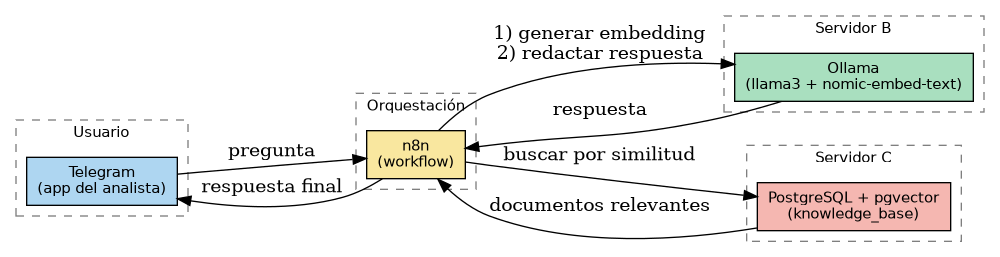
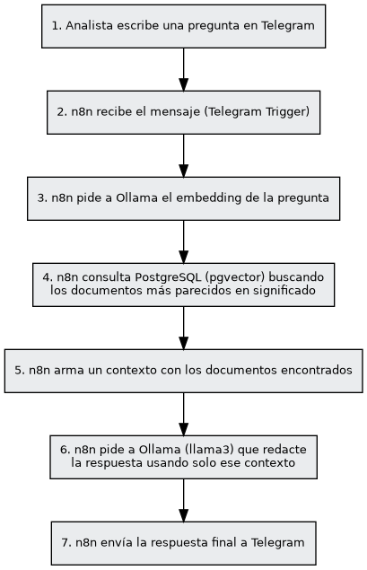
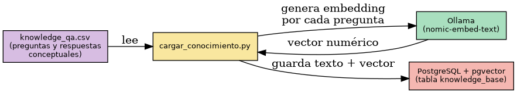

# Analista Virtual de Conciliación Bancaria

Prueba de concepto de un asistente conversacional con **base de conocimiento propia**, que responde preguntas conceptuales sobre conciliación bancaria (qué es, para qué sirve, políticas, procedimientos, roles, y cómo analizar los datos con Python) a través de Telegram.

El objetivo del proyecto es demostrar que se puede construir un asistente de este tipo **usando infraestructura propia de principio a fin**, sin depender de servicios de IA en la nube ni compartir información con terceros.

## Por qué existe este proyecto

Muchos asistentes de este tipo terminan siendo simplemente "un buscador de filas de una base de datos" — se le pregunta por una transacción puntual y el sistema la repite en prosa. Eso no aporta valor: si el usuario ya tiene su archivo de conciliación abierto, no necesita que una IA le repita lo que ya está viendo.

Este proyecto está diseñado con un enfoque distinto: la base de conocimiento contiene **conceptos, políticas, procedimientos y comandos de análisis**, no transacciones. El analista abre su propio archivo de conciliación y le pregunta al asistente cosas como:

- "¿Qué significa el campo `dias_mora`?"
- "¿Qué debo hacer si una transacción tiene el documento faltante?"
- "¿Cómo filtro en Python las transacciones pendientes de mi archivo?"
- "¿Por qué es importante la conciliación bancaria?"

## Arquitectura



| Componente | Rol | Dónde corre |
|---|---|---|
| **Telegram** | Interfaz de usuario (el analista pregunta aquí) | App del analista |
| **n8n** | Orquesta el flujo: recibe el mensaje, llama a Ollama y a PostgreSQL, responde | Servidor propio |
| **Ollama** (`llama3` + `nomic-embed-text`) | Genera los embeddings de las preguntas y redacta las respuestas finales | Servidor propio (Servidor B) |
| **PostgreSQL + pgvector** | Almacena la base de conocimiento y permite buscar por similitud semántica | Servidor propio (Servidor C) |

Toda la infraestructura corre en servidores propios — ningún dato ni pregunta se envía a un proveedor de IA externo.

## Flujo de una pregunta



1. El analista escribe una pregunta en Telegram.
2. n8n recibe el mensaje.
3. n8n le pide a Ollama el *embedding* (representación numérica) de la pregunta.
4. n8n consulta PostgreSQL, que devuelve los documentos de la base de conocimiento más parecidos en significado (no en palabras exactas).
5. n8n arma un contexto con esos documentos.
6. n8n le pide a Ollama (`llama3`) que redacte una respuesta usando *solo* ese contexto.
7. n8n envía la respuesta final al chat de Telegram.

## Pipeline de carga de la base de conocimiento



La base de conocimiento se carga una sola vez (o cada vez que se agrega contenido nuevo) desde archivos CSV con preguntas y respuestas, convertidos a embeddings e indexados en PostgreSQL.

## Estructura del repositorio

```
.
├── README.md
├── requirements.txt
├── .env.example                  # plantilla de configuración (sin claves reales)
├── docs/
│   └── images/                   # diagramas de arquitectura
├── knowledge_base/
│   ├── knowledge_qa.csv          # conceptos, roles, procedimientos, políticas, glosario, casos
│   └── knowledge_qa_python.csv   # comandos de pandas para que el analista explore su propio archivo
├── src/
│   ├── cargar_conocimiento.py    # indexa un CSV de conocimiento en PostgreSQL + pgvector
│   └── asistente.py              # busca + redacta la respuesta (uso desde línea de comandos)
└── n8n/
    └── README.md                 # instrucciones para reconstruir el workflow de Telegram
```

## Contenido de la base de conocimiento

| Categoría | Descripción | Cantidad |
|---|---|---|
| `conceptos` | Qué es y para qué sirve una conciliación bancaria | 7 |
| `roles` | Quién interviene en el proceso y a quién escalar | 5 |
| `procedimiento` | Pasos generales y significado de cada estado | 6 |
| `politicas` | Umbrales y reglas de negocio del proyecto | 6 |
| `glosario` | Explicación de los campos más importantes del dataset | 7 |
| `casos` | Guía de acción por tipo de incidencia | 6 |
| `python` | Comandos de pandas para que el analista explore su propio archivo | 15 |

**Nota importante:** esta base de conocimiento es conceptual y no contiene transacciones reales ni datos sensibles de ninguna empresa. Los umbrales de política (ej. montos, plazos) son valores de ejemplo definidos para esta prueba de concepto y deben ajustarse a la política real de cada organización antes de usarse en producción.

## Instalación y uso

### 1. Requisitos previos

- Un servidor con [Ollama](https://ollama.com) corriendo, con los modelos `llama3` y `nomic-embed-text` descargados:
  ```bash
  ollama pull llama3
  ollama pull nomic-embed-text
  ```
- Un servidor con PostgreSQL 16+ y la extensión [pgvector](https://github.com/pgvector/pgvector) instalada.
- Python 3.10+

### 2. Configuración

```bash
git clone <este-repositorio>
cd analista-virtual-conciliacion
pip install -r requirements.txt
cp .env.example .env
# Edita .env con tus datos reales (host de Ollama, host de Postgres, clave, etc.)
```

### 3. Cargar la base de conocimiento

```bash
python3 src/cargar_conocimiento.py --input knowledge_base/knowledge_qa.csv
python3 src/cargar_conocimiento.py --input knowledge_base/knowledge_qa_python.csv
```

### 4. Probar desde línea de comandos

```bash
python3 src/asistente.py "¿por qué es importante la conciliación bancaria?"
```

### 5. Conectar a Telegram

Ver [`n8n/README.md`](n8n/README.md) para las instrucciones de cómo reconstruir el workflow de n8n que conecta Telegram con este pipeline.

## Seguridad

- Ningún dato transaccional real se usa en este proyecto — solo conocimiento conceptual.
- Las credenciales viven en un archivo `.env` local, nunca en el código ni en este repositorio (ver `.gitignore`).
- **Recomendación pendiente para producción**: restringir el acceso a los puertos de Ollama (`11434`) y PostgreSQL (`5432`) solo a las IPs que realmente los necesitan, en vez de dejarlos abiertos a cualquier IP.

## Estado del proyecto

Prueba de concepto funcional: base de conocimiento indexada, búsqueda semántica funcionando, respuestas redactadas por `llama3`, e integración con Telegram vía n8n operativa.

Pendientes conocidos para una versión de producción:
- Ampliar el contenido de la base de conocimiento con validación de un analista experto en el proceso real de la empresa.
- Memoria de conversación (que el bot recuerde preguntas anteriores del mismo chat).
- Restringir el acceso de red solo a IPs autorizadas.
- Evaluar un servidor con GPU si el tiempo de respuesta de `llama3` se vuelve una limitante.
